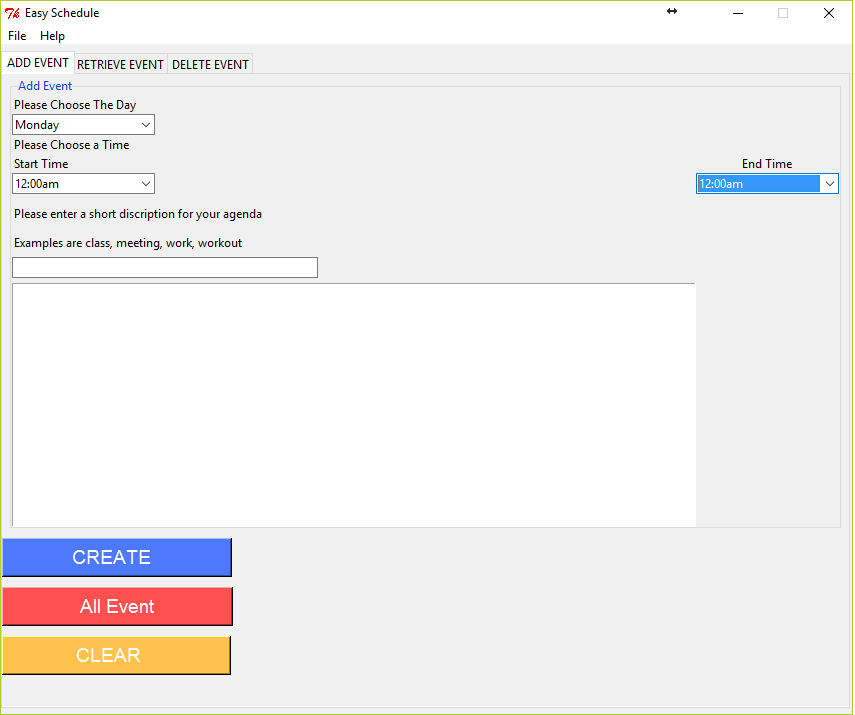
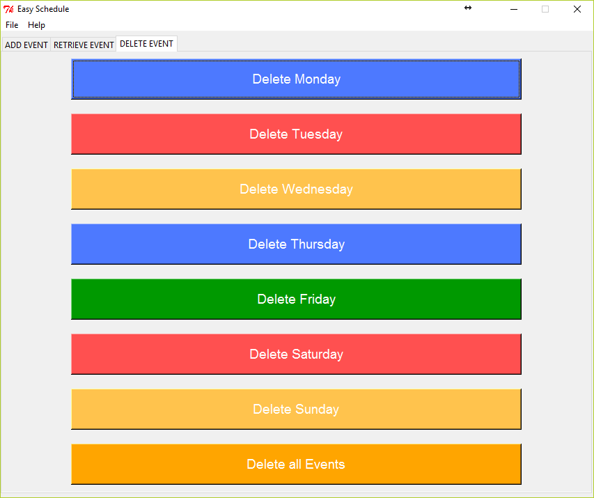

# python-scheduleApp
##This is a simple python schedule app with Tkinter written in python2.7x.

The use of this app is to create and manage your weekly schedule easily and simple.
It stores your shecdule in a file with the date and
time it was created decorated into a table-like form using pretty table which can be installed by running
```
pip install pretty-table
```
####Below are the screenshot of Add, Retrieve and Delete Event respectively
Add Event screenshot: 


Retrieve Event screenshot:


Delete Event screenshot


